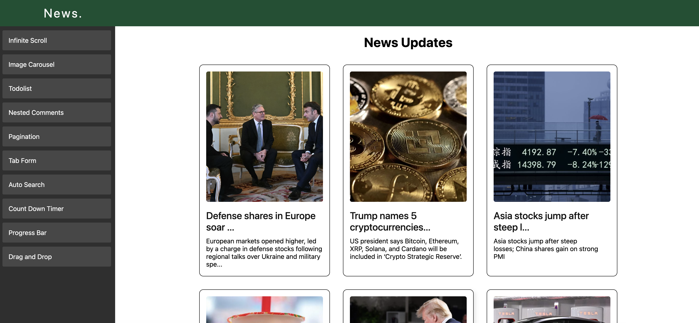
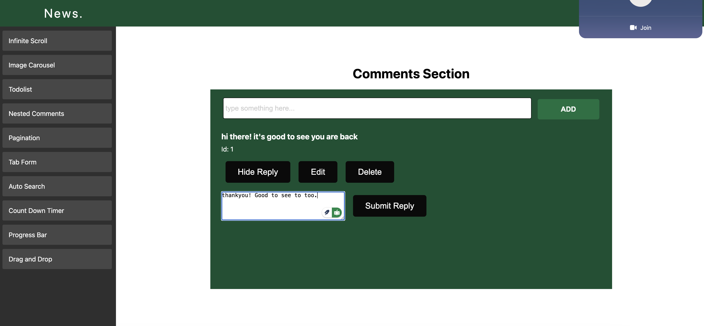
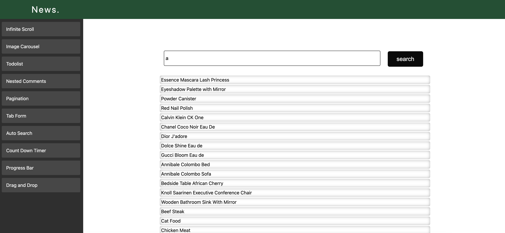
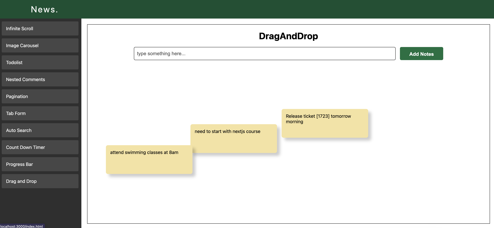
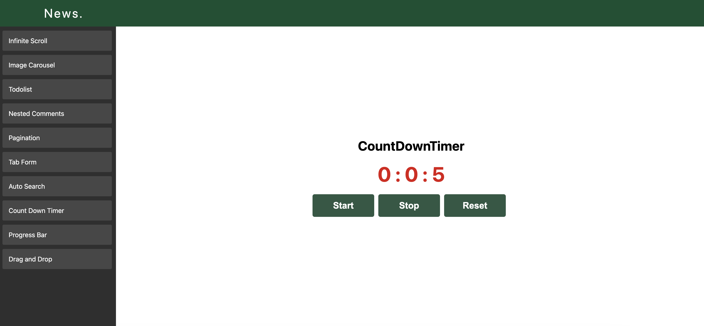
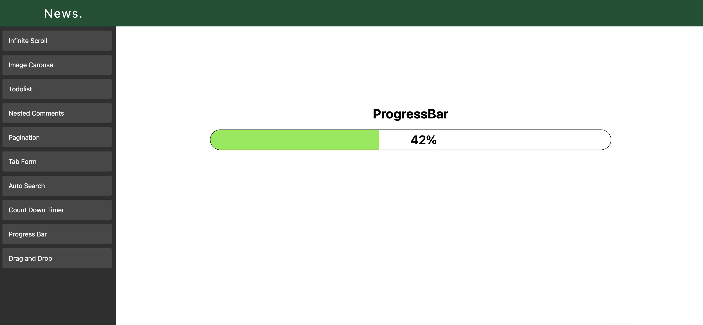

# React Feature-based Web Application

This is a React-based web application that offers multiple interactive features, including a blog section, login form, image carousel, to-do list, and more. The application is built using React Router for seamless navigation and dynamic content rendering.

## Project Structure

The project is organized using a modular component-based structure, ensuring scalability and maintainability. Here's a breakdown of the main components:

## Main Layout Structure
- html-container: The outermost container that wraps the entire application.
- NavBar: A navigation bar that provides links for navigating to different sections of the app.
- body-container: Contains the main content, including an accordion and the dynamic routing area.
- content-container: A section where React Router dynamically loads the relevant component based on the route.

## Features/Components
The following components are loaded dynamically based on the URL route:

- **BlogsContainer**: Displays a collection of blogs.
- **ImageCarousel**: An interactive image carousel to display images in a slideshow format.
- **Todolist**: A to-do list where users can manage tasks.
- **NestedCommentsSection**: A section to view and post comments.
- **Pagination**: A pagination component to navigate through large sets of content.
- **AutoSearch**: A search bar with real-time suggestions as the user types.
- **CountDownTimer**: A countdown timer for events or time-sensitive tasks.
- **ProgressBar**: A visual progress bar to indicate the completion status of a task.
- **StarRating**: A rating system to collect user feedback.
- **DragAndDrop**: A component allowing users to drag and drop elements within the UI.

## Tech Stack
- **React**: A JavaScript library for building user interfaces.
- **React Router**: For managing navigation and routing within the app.
- **CSS**: For styling the components and layout.

## Screenshots of website

Feel free to modify or add any additional details specific to your project, such as contributing guidelines, known issues, or future enhancements!
